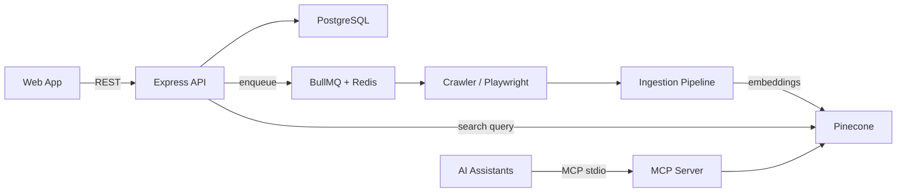

# JigSaw

> AI-powered web scraping and knowledge retrieval platform. Crawl websites, generate vector embeddings, and build a semantic knowledge base you can search via web UI or MCP.

[]()
[]()
[](https://bun.sh)
[](https://www.typescriptlang.org)

---

## Table of Contents

- [Why JigSaw?](#why-jigsaw)
- [Features](#features)
- [Architecture](#architecture)
- [Quick Start](#quick-start)
- [Tech Stack](#tech-stack)
- [Project Structure](#project-structure)
- [API Endpoints](#api-endpoints)
- [MCP Server](#mcp-server)
- [Database Schema](#database-schema)
- [Environment Variables](#environment-variables)
- [Commands](#commands)
- [Code Standards](#code-standards)
- [Contributing](#contributing)
- [License](#license)

---

## Why JigSaw?

Most web scraping tools give you raw HTML. JigSaw turns that into **searchable knowledge**. It crawls websites, chunks the content, generates vector embeddings, and stores everything in a vector database for semantic search — accessible through a polished web UI or directly by AI assistants via the Model Context Protocol (MCP).

**Use cases:**
- Build a searchable knowledge base from documentation sites
- Create AI-ready datasets from blog posts or articles
- Power AI assistants with real-time web knowledge
- Monitor and re-crawl sources on a schedule

---

## Features

| Feature | Description |
|---------|-------------|
| **Semantic Search** | Search your knowledge base by meaning, not just keywords |
| **Web Crawler** | Playwright-powered scraper with scheduled re-crawling |
| **MCP Integration** | Expose your knowledge base to AI assistants (Claude, etc.) |
| **Vector Embeddings** | OpenAI `text-embedding-3-small` with 1536 dimensions |
| **Job Monitoring** | Track crawl job status in real-time |
| **Source Management** | Add, remove, and manage your crawled sources |
| **Dark-Mode UI** | Purple-accented glassmorphism interface |
| **Monorepo** | Turborepo-powered with shared types across all packages |

---

## Architecture

```
┌─────────────┐     ┌──────────────┐     ┌─────────────────┐
│  Web App    │────▶│  Express API │────▶│  PostgreSQL     │
│  (Next.js)  │     │  (REST)      │     │  (metadata)     │
└─────────────┘     └──────┬───────┘     └─────────────────┘
                           │
                           ▼
                    ┌──────────────┐     ┌─────────────────┐
                    │  BullMQ      │────▶│  Redis          │
                    │  (job queue) │     │  (queue store)  │
                    └──────┬───────┘     └─────────────────┘
                           │
                           ▼
                    ┌──────────────┐     ┌─────────────────┐
                    │  Crawler     │────▶│  Ingestion      │
                    │  (Playwright)│     │  (embed + store)│
                    └──────────────┘     └────────┬────────┘
                                                  │
                                                  ▼
                                          ┌─────────────────┐
                                          │  Pinecone       │
                                          │  (vector DB)    │
                                          └─────────────────┘
```



---

## Quick Start

### Prerequisites

- [Bun](https://bun.sh/) >= 1.2
- PostgreSQL
- Redis
- [OpenAI API key](https://platform.openai.com/api-keys)
- [Pinecone API key](https://www.pinecone.io/)

### 1. Clone and install

```bash
git clone <repo-url> jigsaw
cd jigsaw
bun install
```

### 2. Configure environment

```bash
cp .env.example .env
# Edit .env with your credentials
```

### 3. Set up the database

```bash
bun run db:generate
bun run db:migrate
```

### 4. Start development servers

```bash
bun run dev
```

The web app runs on **http://localhost:3000** and the API on **http://localhost:3001**.

---

## Tech Stack

| Layer | Technology | Version |
|---|---|---|
| Frontend | Next.js (App Router) | ^14.2.0 |
| UI | React, Tailwind CSS, Framer Motion | ^18.3.0 |
| Backend | Express, TypeScript | ^4.21.0 |
| ORM | Drizzle | ^0.33.0 |
| Database | PostgreSQL | — |
| Queue | BullMQ + Redis | — |
| Embeddings | OpenAI `text-embedding-3-small` | 1536 dims |
| Vector DB | Pinecone | — |
| Browser | Playwright | — |
| MCP | `@modelcontextprotocol/sdk` | ^2.0.0 |
| Monorepo | Turborepo | latest |
| Package Manager | Bun | >= 1.2 |

---

## Project Structure

```
jigsaw/
├── apps/
│   ├── api/                  # Express REST API
│   │   └── src/
│   │       ├── index.ts              # Entry point (CORS, Helmet, routes)
│   │       └── routes/
│   │           ├── search.ts         # POST /api/search
│   │           ├── sources.ts        # CRUD /api/sources
│   │           └── jobs.ts           # CRUD /api/jobs
│   └── web/                  # Next.js frontend
│       └── src/
│           ├── app/
│           │   ├── page.tsx          # Landing page
│           │   ├── search/page.tsx   # Semantic search UI
│           │   ├── sources/page.tsx  # Source management
│           │   └── jobs/page.tsx     # Crawl job monitor
│           ├── components/           # UI components (shadcn-style)
│           └── lib/api.ts            # Typed API client
├── packages/
│   ├── shared/               # Shared types & utilities
│   ├── db/                   # Drizzle ORM + PostgreSQL schema
│   ├── crawler/              # Playwright scraper + BullMQ jobs (stub)
│   ├── ingestion/            # Chunking, embeddings, Pinecone (stub)
│   └── mcp-server/           # MCP server for AI assistants
├── turbo.json
├── tsconfig.base.json
└── vitest.config.ts
```

---

## API Endpoints

| Method | Path | Description |
|---|---|---|
| `GET` | `/health` | Health check |
| `POST` | `/api/search` | Semantic search — `{ query, limit?, sourceId?, threshold? }` |
| `GET` | `/api/sources` | List all sources |
| `POST` | `/api/sources` | Create a source — `{ url, name, crawlFrequency? }` |
| `DELETE` | `/api/sources/:id` | Delete a source |
| `GET` | `/api/jobs` | List all crawl jobs |
| `POST` | `/api/jobs/crawl/:sourceId` | Trigger a crawl for a source |
| `GET` | `/api/jobs/:id` | Get job status |

---

## MCP Server

The MCP server exposes tools for AI assistants via **stdio transport**.

### Available Tools

| Tool | Description |
|------|-------------|
| `search_knowledge_base` | Semantic search across crawled content |
| `list_sources` | List all indexed sources |
| `add_source` | Add a new URL to crawl |
| `crawl_status` | Check crawl job status |

### Usage with Claude Desktop

Add to your `claude_desktop_config.json`:

```json
{
  "mcpServers": {
    "jigsaw": {
      "command": "node",
      "args": ["packages/mcp-server/dist/index.js"]
    }
  }
}
```

---

## Database Schema

### `users`

| Column | Type | Notes |
|---|---|---|
| `id` | UUID | Primary key |
| `email` | VARCHAR(255) | Unique |
| `name` | VARCHAR(255) | Nullable |
| `password_hash` | VARCHAR(255) | |
| `created_at` | TIMESTAMP | |
| `updated_at` | TIMESTAMP | |

### `sources`

| Column | Type | Notes |
|---|---|---|
| `id` | UUID | Primary key |
| `user_id` | UUID | FK → users |
| `url` | TEXT | |
| `name` | VARCHAR(255) | |
| `crawl_frequency` | VARCHAR(50) | Nullable |
| `last_crawled_at` | TIMESTAMP | Nullable |
| `created_at` | TIMESTAMP | |
| `updated_at` | TIMESTAMP | |

### `crawl_jobs`

| Column | Type | Notes |
|---|---|---|
| `id` | UUID | Primary key |
| `source_id` | UUID | FK → sources |
| `status` | VARCHAR(20) | `queued` / `running` / `completed` / `failed` |
| `started_at` | TIMESTAMP | Nullable |
| `completed_at` | TIMESTAMP | Nullable |
| `error` | TEXT | Nullable |
| `created_at` | TIMESTAMP | |

---

## Environment Variables

| Variable | Description | Default |
|---|---|---|
| `DATABASE_URL` | PostgreSQL connection string | — |
| `REDIS_URL` | Redis connection string | — |
| `OPENAI_API_KEY` | OpenAI API key for embeddings | — |
| `PINECONE_API_KEY` | Pinecone API key | — |
| `PINECONE_INDEX` | Pinecone index name | `jigsaw` |
| `API_PORT` | API server port | `3001` |
| `API_SECRET` | JWT secret for auth | — |
| `NEXT_PUBLIC_API_URL` | Backend URL for web app | `http://localhost:3001` |

---

## Commands

```bash
bun install              # Install all dependencies
bun run build            # Build all packages
bun run dev              # Start api + web in dev mode
bun run lint             # Lint all packages
bun run check-types      # TypeScript check all packages
bun run test             # Run tests
bun run test:watch       # Run tests in watch mode
bun run db:generate      # Generate Drizzle migrations
bun run db:migrate       # Run migrations
```

---

## Code Standards

- TypeScript strict mode
- ES modules (`type: "module"`)
- `workspace:*` for internal package references
- Import types from `@jigsaw/shared`
- Validate inputs with Zod
- Use Drizzle for all DB queries (no raw SQL unless necessary)
- Dark-mode-first UI with purple primary (`#5519f7`)
- No icon library — inline SVGs only

---

## Non-Goals (for now)

- Multi-language content support (English only initially)
- Real-time collaborative features in the web app
- Support for vector databases other than Pinecone
- Self-hosted deployment guides (cloud deployment TBD)

---

## Contributing

1. Fork the repo
2. Create a branch: `git checkout -b feature/my-feature`
3. Make your changes and add tests
4. Run tests: `bun run test`
5. Run type check: `bun run check-types`
6. Run lint: `bun run lint`
7. Submit a PR with a description of your change

We respond to all PRs within 48 hours.

---

## License

Private — All rights reserved.
